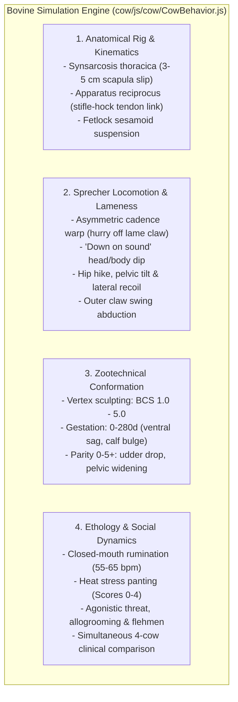

# 🚜 Barn Simulation & 3D Bovine Digital Twin Lab (*Bos taurus*)

[](https://threejs.org/)
[](https://www.khronos.org/webgl/)
[]()
[]()
[]()
[](https://opensource.org/licenses/MIT)

> **Live Interactive Portal:** [https://klandermans.github.io/barnsimulation/](https://klandermans.github.io/barnsimulation/)

An advanced web-based 3D research and simulation platform bridging precision livestock farming, veterinary biomechanics, and computer vision. Developed as an evolving sandbox inspired by agricultural engineering and animal welfare research at **Wageningen University & Research (WUR)**.

---

## Table of Contents

1. [Overview & Project Evolution](#1-overview--project-evolution)
2. [The 6 Modular Prototypes (Lab Portal)](#2-the-6-modular-prototypes-lab-portal)
3. [Flagship: Prototype 6.0 — High-Fidelity 3D Dairy Cow Simulator](#3-flagship-prototype-60--high-fidelity-3d-dairy-cow-simulator)
4. [Scientific Validation & Peer-Reviewed Literature Grounding](#4-scientific-validation--peer-reviewed-literature-grounding)
5. [Repository Structure](#5-repository-structure)
6. [Technology Stack & Zero-Build Architecture](#6-technology-stack--zero-build-architecture)
7. [Quickstart & Local Execution](#7-quickstart--local-execution)
8. [License & Acknowledgements](#8-license--acknowledgements)

---

## 1. Overview & Project Evolution

What started as a creative proof-of-concept simulating barn movements with moving cubes has grown into a multi-tiered **Digital Twin ecosystem for dairy farming**. The platform is designed to make complex agricultural, ethological, and sensor data tangible in real time directly within the browser without requiring specialized software installations.

### Core Applications
* **Precision Livestock Farming (PLF):** Virtual testing of cow traffic, sensor placement, and camera perspectives in modern barn structures (milieustal, voedingstal, melkstal).
* **Synthetic Dataset Generation:** Ground-truth data synthesis for 2D/3D bovine pose estimation (YOLO-pose, DeepLabCut, SLEAP) with zero human labeling noise.
* **Automated Lameness Detection:** Biomechanically accurate simulation of Sprecher locomotion scores (1 to 5) with asymmetric footfall cadence, "Down on sound" head and shoulder dips, and lateral body recoils.
* **Zootechnical & Morphological Modeling:** Dynamic anatomical vertex sculpting reflecting Body Condition Score (BCS 1.0–5.0), gestation progress (0–280 days), parity/age (heifer to mature cow), and rumen fill.

---

## 2. The 6 Modular Prototypes (Lab Portal)

The unified web portal ([`index.html`](file:///Users/bert/dev/barnsimulation/index.html)) provides instant modular access to six specialized simulation prototypes:

```
                               ┌──────────────────────────────────────────────┐
                               │  Barn Simulation Portal (index.html)        │
                               │  PROTOCOL: BLCA-v5.0                         │
                               └──────────────────────┬───────────────────────┘
                                                      │
         ┌──────────────────┬─────────────────┼─────────────────┬──────────────────┬─────────────────┐
         ▼                  ▼                 ▼                 ▼                  ▼                 ▼
   [Prototype 1.0]    [Prototype 2.0]   [Prototype 3.0]   [Prototype 4.0]    [Prototype 5.0]   [Prototype 6.0]
    Camera Views       Barn Experience   NLAS Simulation   Real Calibration   Roblox Farm Game  The 3D Dairy Cow
     (/camera/)           (/game/)          (/nlas/)          (/real/)          (/roblox/)          (/cow/)
```

| Prototype | Directory | Focus & Key Features | Primary Controls |
|:---|:---|:---|:---|
| **1.0 View Camera** | [`camera/`](file:///Users/bert/dev/barnsimulation/camera/) | Orbital camera rig, projection matrices, perspective and focal length inspection. | Mouse orbit, Pan, Zoom |
| **2.0 Barn Simulation Experience** | [`game/`](file:///Users/bert/dev/barnsimulation/game/) | Interactive 3D barn with dynamic lighting, shadows, physical cubicles, feeding alleys, and collision avoidance. | WASD / Arrow keys + Mouse or Gamepad |
| **3.0 NLAS Simulation Experience** | [`nlas/`](file:///Users/bert/dev/barnsimulation/nlas/) | Large-scale spatial barn chunks, multi-angle overhead monitoring, and cow trajectory tracking. | Cursors / WASD + Mouse |
| **4.0 Calibrated Real Simulation** | [`real/`](file:///Users/bert/dev/barnsimulation/real/) | Multi-camera synchronization, calibrated extrinsic/intrinsic matrices (`calibration.json`, `.npz`), and 19 3D bovine anatomical keypoint projections. | Camera presets, Keypoint toggles |
| **5.0 Roblox Farm Game** | [`roblox/`](file:///Users/bert/dev/barnsimulation/roblox/) | Interactive farm game environment incorporating architectural CAD blueprints of modern Dutch barns (milieustal, melkstal, voedingstal). | Touch Mobile / Gamepad / WASD |
| **6.0 The 3D Dairy Cow** | [`cow/`](file:///Users/bert/dev/barnsimulation/cow/) | State-of-the-art biomechanical, zootechnical, and ethological dairy cow simulator (*Bos taurus*). | Comprehensive UI Control Panel |

---

## 3. Flagship: Prototype 6.0 — High-Fidelity 3D Dairy Cow Simulator

Located in [`cow/`](file:///Users/bert/dev/barnsimulation/cow/), Prototype 6.0 represents an authentic biological digital twin of a Dutch Holstein-Friesian milk cow (*Cow_F* with functional udder and 49-bone armature).



### 3.1 Natural Limping & Sprecher Lameness Kinematics
Unlike generic animations that simply twist bones, the simulator implements true veterinary locomotion mechanics:
* **Temporal Cadence Warping (`_computeCadenceWarp`):** 
  * *Hurry off the lame leg:* Stance time on the painful claw is dynamically accelerated (+40% to +65%) to minimize weight-bearing duration.
  * *Lingering on the sound leg:* Stance time on the healthy contralateral limb is extended (-25% to -35%), producing an unmistakable asymmetric limp rhythm (*tap... TAAAP, tap... TAAAP*).
* **"Down on Sound" Head-Nod Dynamics:**
  * *Forelimb Lameness (FL / FR):* Head and neck throw **UP** on painful hoof impact (unweighting the front limb) and drop deeply **DOWN** onto the sound forelimb as body mass is absorbed by the healthy shoulder.
  * *Hindlimb Lameness (HL / HR):* Head dips **DOWN** on painful hind impact to transfer center of mass forward over the withers, returning upward on the sound hind step.
* **Body Dip & Lateral Recoil:**
  * Vertical drop of the center of mass ([`bones.root.position.y`](file:///Users/bert/dev/barnsimulation/cow/js/cow/CowBehavior.js)) into the sound supporting limb.
  * Lateral body sway ([`bones.root.position.x`](file:///Users/bert/dev/barnsimulation/cow/js/cow/CowBehavior.js)) and pelvic roll tilting *away* from the painful claw.
* **Stiff Pastern (Fetlock Suspension Guard):** Pastern hyperextension is reduced during painful stance to prevent strain on sesamoidean ligaments, with cocked-hock toe-touching in standing rest.
* **Hind Claw Abduction:** Outward swinging arc (8°–20°) during swing phase to avoid inner claw and udder collision.

### 3.2 Zootechnical Conformation (BCS, Gestation & Parity)
* **Body Condition Score (BCS 1.0 to 5.0, Ferguson / Edmonson scale):**
  * *Emaciated (BCS 1.0–2.5):* Prominent 13 ribs (*costae*), deep hollow hunger groove (*fossa paralumbalis*), sharp horizontal lumbar shelf, razorback dorsal line (*processus spinosi*), deep sunken tailhead cavity (*cavitas sacralis*), and sharp V-line between hooks (*tuber coxae*) and pins (*tuber ischiadica*).
  * *Obese (BCS 3.75–5.0):* Padded flat back, filled hunger groove, rounded hooks/pins, heavy brisket/dewlap, and bulging adipose cushions (*fat patches*) beside the tailhead.
* **Gestation & Pregnancy (0 to 280 days):**
  * *Ventral Abdominal Sag:* Progressive belly drop under the weight of the 45–65 kg fetus, placenta, and fluids.
  * *Right Flank Asymmetry:* Pronounced unilateral bulge on the right abdominal floor where the gravid uterus rests.
  * *Pre-Partum Udder Edema & Colostrogenesis (Day 240–280):* Udder swelling and teat distension in late pregnancy.
  * *Relaxin Pelvic Relaxation (Day 266–280):* Sinking of sacro-sciatic ligaments beside the tailhead prior to calving.
  * *Waddling Gait:* Widened hindlimb stance and pelvic waddle in walking gait to clear the heavy abdomen.
* **Parity & Age (Parity 0 to 5+):**
  * *Heifer (Parity 0, ~2 years):* Compact frame, narrower pin bones, tightly suspended juvenile udder held high above the hocks, brisk step (+8% cadence).
  * *Mature Cow (Parity 4–5+, 6–8+ years):* Broad pelvic pin spread, deeper ribcage, stretched lateral suspensory ligament (*ligamentum suspensorium*) causing the udder floor to drop closer to the hocks, and a heavier, more deliberate walking pace (-12% base speed).

---

## 4. Scientific Validation & Peer-Reviewed Literature Grounding

The digital twin's algorithms are directly benchmarked against 19 seminal papers in bovine biomechanics, veterinary medicine, and ethology:

* **Sprecher et al. (1997):** 5-point locomotion scoring system for dairy cattle.
* **Flower & Weary (2006):** Gait assessment, hoof contact timing, and duty cycle reduction under claw pain.
* **van der Tol et al. (2002, 2003):** Ground reaction forces (GRF) and lateral claw pressure distributions.
* **Dyce, Sack & Wensing (2010):** *Textbook of Veterinary Anatomy* — synsarcosis thoracica and apparatus reciprocus kinematics.
* **Cook & Nordlund (2009):** Cow comfort, resting postures, cocked-hock stance, and stall design interactions.
* **Lidfors (1989):** Biomechanics of lying down and the obligate "hindquarters-first" standing up sequence.
* **Ferguson et al. (1994) / Edmonson et al. (1989):** Body Condition Scoring (BCS) anatomical landmarks.
* **Schirmann et al. (2012) / Albright & Arave (1997):** Ethological time budgets, closed-mouth rumination, and pasture play behavior.

> Detailed mathematical proofs and references can be found in [`cow/research.md`](file:///Users/bert/dev/barnsimulation/cow/research.md) and [`cow/research_validation_paper.md`](file:///Users/bert/dev/barnsimulation/cow/research_validation_paper.md).

---

## 5. Repository Structure

```
barnsimulation/
├── index.html                    # Unified Lab Portal (PROTOCOL: BLCA-v5.0)
├── README.md                     # Central project & laboratory documentation
├── camera/                       # Prototype 1.0: Camera projection rig
│   └── index.html
├── game/                         # Prototype 2.0: Interactive Barn Experience
│   ├── index.html
│   ├── cow4.glb
│   └── ric-optimized.glb
├── nlas/                         # Prototype 3.0: NLAS Barn Simulation
│   ├── index.html
│   └── chunk/
├── real/                         # Prototype 4.0: Calibrated 3D Real Simulation
│   ├── index.html
│   ├── calibration.json          # Extrinsic and intrinsic camera parameters
│   └── calibration_2026_06_29.npz
├── roblox/                       # Prototype 5.0: Roblox Farm Game & Barn Blueprints
│   ├── index.html
│   ├── barn_textured.glb
│   ├── models/
│   └── *.pdf                     # Architectural floorplans (milieustal, melkstal, etc.)
└── cow/                          # Prototype 6.0: High-Fidelity 3D Dairy Cow Simulator
    ├── index.html                # Main cow simulator interface
    ├── style.css                 # Responsive UI & research telemetry drawer styling
    ├── research.md               # Biomechanical analysis & 3D model taxonomy
    ├── research_validation_paper.md # Peer-reviewed validation paper & proofs
    ├── js/
    │   ├── main.js               # Three.js scene, camera modes, animation loop
    │   ├── cow/
    │   │   ├── CowBehavior.js    # Kinematics, lameness model, BCS vertex deformer
    │   │   ├── HerdManager.js    # Multi-cow herd controller (4-cow herd interactions)
    │   │   ├── BreedingValues.js # Genetic trait expressions (NVI/CRV)
    │   │   ├── CowAnimator.js    # Procedural clip generator
    │   │   ├── CowMesh.js        # Mesh materials and procedural shaders
    │   │   └── CowRig.js         # Skeleton bone mapping and constraints
    │   ├── env/
    │   │   └── PastureEnvironment.js # Realistic pasture, daylight sky, ground grid
    │   ├── ui/
    │   │   ├── ControlPanel.js   # Parameter bindings, sliders, telemetry updates
    │   │   └── GaitController.js # Gait state helper
    │   └── utils/
    │       ├── IKSolver.js       # Two-bone Analytical Inverse Kinematics solver
    │       └── PhysicsSpring.js  # Second-order harmonic oscillator spring physics
    ├── models/
    │   └── cow_melkkoe.glb       # Rigged biological Cow_F model with complete animation suite
    └── textures/                 # High-resolution PBR textures (black & white, red, blaarkop)
```

---

## 6. Technology Stack & Zero-Build Architecture

* **Zero Build Step:** Built entirely with standard modern web technologies. No Webpack, Vite, or npm compilation required.
* **Native ES Modules & Importmaps:** Dependencies (Three.js `r160+`, OrbitControls, GLTFLoader) are resolved natively in the browser via standard import maps.
* **Hardware-Accelerated WebGL 2.0:** ACES Filmic Tone Mapping, PCF Soft Shadow Maps, and real-time PBR shaders.
* **High-Precision Morphing:** Vertex-level dynamic deformation for BCS, gestation, and rumen volume that operates without exponential compounding.
* **Cross-Platform Input:** Responsive design supporting Desktop (Mouse & Keyboard), Mobile (Touch), and Gamepads/Controllers.

---

## 7. Quickstart & Local Execution

Because the project uses native ES modules and loads local GLTF/GLB models, it should be served through any standard HTTP server (to satisfy browser CORS policies):

### Option A: Python 3 (Recommended)
```bash
# Clone the repository
git clone https://github.com/klandermans/barnsimulation.git
cd barnsimulation

# Launch local HTTP server
python3 -m http.server 8765
```
Open your browser and navigate to:
* **Lab Portal:** `http://localhost:8765/`
* **3D Cow Simulator:** `http://localhost:8765/cow/`
* **Barn Experience:** `http://localhost:8765/game/`
* **Roblox Farm Game:** `http://localhost:8765/roblox/`

### Option B: Node.js (npx serve)
```bash
npx serve -l 8765 .
```

### Option C: VS Code Live Server
Right-click on `index.html` and select **"Open with Live Server"**.

---

## 8. License & Acknowledgements

* **License:** This project is licensed under the [MIT License](LICENSE).
* **Inspiration:** Developed to inspire colleagues and students within **Wageningen University & Research (WUR)**, agricultural engineering departments, and livestock robotics teams.
* **Contributions:** Inquiries, pull requests, and scientific collaborations are warmly welcomed. Feel free to fork, experiment, and build further upon this sandbox!
