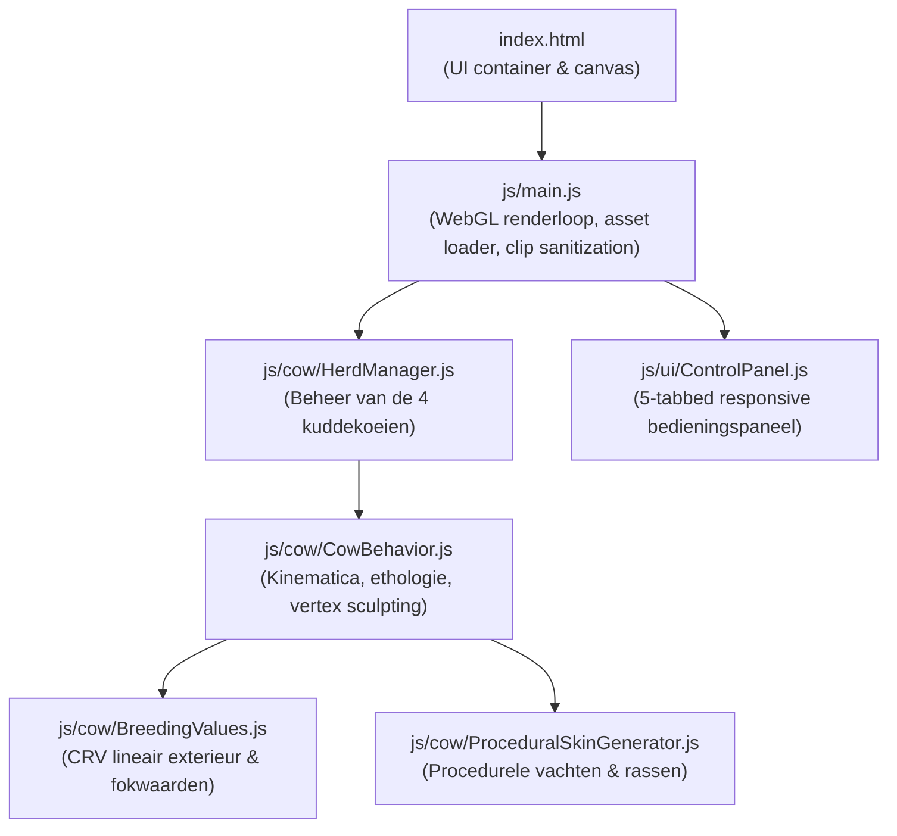

# 🐄 Koe Simulator — Uitgebreide Handleiding & Technische Documentatie van alle Instellingen

Deze handleiding beschrijft **alle instellingen, parameters, wiskundige formules en biologische modellen** die zijn geïmplementeerd in de 3D Koe Simulator van Wageningen University & Research (Next Level Animal Science).

---

## Inhoudsopgave
1. [Systeemarchitectuur & Modulaire Opbouw](#1-systeemarchitectuur--modulaire-opbouw)
2. [Tab 1: Fenotype (CRV Exterieur, Fokkerij & Raskenmerken)](#2-tab-1-fenotype-crv-exterieur-fokkerij--raskenmerken)
   - [Bovenbalk Exterieur (88–112+)](#21-bovenbalk-exterieur-88112)
   - [De 20 Officiële CRV Lineaire Exterieurkenmerken](#22-de-20-officiële-crv-lineaire-exterieurkenmerken)
   - [Exterieur Presets](#23-exterieur-presets)
   - [Hoorns & Hoornstatus](#24-hoorns--hoornstatus)
   - [Rassen & Vachtpatronen](#25-rassen--vachtpatronen)
3. [Tab 2: Productie & Robotgeschiktheid](#3-tab-2-productie--robotgeschiktheid)
   - [Fokwaarden Melkproductie (NVI / INET)](#31-fokwaarden-melkproductie-nvi--inet)
   - [Robotgeschiktheidsindex (AMS)](#32-robotgeschiktheidsindex-ams)
   - [Fysiologische Uierstuwing](#33-fysiologische-uierstuwing)
4. [Tab 3: Gangwerk, Voortbeweging & Kreupelheid (Sprecher 1–5)](#4-tab-3-gangwerk-voortbeweging--kreupelheid-sprecher-15)
   - [Symmetrisering van het Gangwerk (Oplossing Asymmetrische Stap)](#41-symmetrisering-van-het-gangwerk-oplossing-asymmetrische-stap)
   - [Locomotiescores conform Sprecher et al. (1997)](#42-locomotiescores-conform-sprecher-et-al-1997)
   - [Kreupelheidspresets & Individuele Klauwscores](#43-kreupelheidspresets--individuele-klauwscores)
   - [Gangvormen & Activiteiten](#44-gangvormen--activiteiten)
5. [Tab 4: Welzijn & Fysiologie (Koesignalen & Morfometrie)](#5-tab-4-welzijn--fysiologie-koesignalen--morfometrie)
   - [Body Condition Score (BCS 1.0–5.0) & Vertex-Sculpting](#51-body-condition-score-bcs-1050--vertex-sculpting)
   - [Laterale Pootvrijwaring (Anti-Clipping Systeem voor Vette Koeien)](#52-laterale-pootvrijwaring-anti-clipping-systeem-voor-vette-koeien)
   - [Dracht & Gestatiedagen (0–280 dagen)](#53-dracht--gestatiedagen-0280-dagen)
   - [Pensvulling (Zaagmethode Jan Hulsen 1–5)](#54-pensvulling-zaagmethode-jan-hulsen-15)
   - [Pariteit (Vaars t/m 5e kalfs)](#55-pariteit-vaars-tm-5e-kalfs)
   - [Herkauwgedrag & Jan Hulsen Kauwslagenteller](#56-herkauwgedrag--jan-hulsen-kauwslagenteller)
   - [Hittestress & Ademhaling (Panting Score 0–4)](#57-hittestress--ademhaling-panting-score-04)
   - [Lighoudingen & Transities](#58-lighoudingen--transities)
6. [Tab 5: Kudde-Ethologie & Camera](#6-tab-5-kudde-ethologie--camera)
7. [Technische Implementatiedetails (Onder de Motorkap)](#7-technische-implementatiedetails-onder-de-motorkap)

---

## 1. Systeemarchitectuur & Modulaire Opbouw

De simulator is opgebouwd uit modulaire ES-modules zonder externe build-stap (zuiver native WebGL via Three.js r160):

### Belangrijkste Codebestanden:
* **`js/main.js`**: Initialiseert de Three.js Scene, Camera, OrbitControls en verlichting. Laadt het 3D-model (`models/cow_melkkoe.glb`) en past de runtime **quaternion-symmetrisering** toe op alle loopclips (`sanitizeLocomotionClips`).
* **`js/cow/CowBehavior.js`**: Het centrale brein van elk individueel rund. Bevat de logica voor ademhaling, herkauwen, lighoudingen, botrotaties, gesloten kinematische ketens en de real-time vertex-sculpting pipeline.
* **`js/cow/BreedingValues.js`**: Beheert de CRV/WHFF exterieurprofielen, fokwaardeberekeningen en lineaire kenmerken (schaal 88–112).
* **`js/cow/HerdManager.js`**: Stuurt de kudde van 4 koeien aan (Bertha, Clara, Mina, Emma) met individuele eigenschappen en sociale afstand.
* **`js/ui/ControlPanel.js`**: Biedt een overzichtelijke 5-tab interface waarin alle parameters realtime kunnen worden gemanipuleerd en gemonitord.

---

## 2. Tab 1: Fenotype (CRV Exterieur, Fokkerij & Raskenmerken)

In deze tab worden alle **erfelijke en fysieke exterieurkenmerken** beheerd conform de standaarden van de Coöperatie Rundveeverbetering (CRV) en de World Holstein Friesian Federation (WHFF).

### 2.1 Bovenbalk Exterieur (88–112+)
De bovenbalk toont de samengestelde hoofdcategorieën van de stamboekkeuring (gemiddelde = 100, standaarddeviatie $\sigma = 4$):
* **Frame**: Samengesteld uit hoogtemaat, voorhand, inhoud, openheid en kruismaten.
* **Type**: Melktype en wigvorm (dairy wedge), scherpte van de schoft en droge botstructuur.
* **Uier**: Algemene uierkwaliteit, diepte, balans en speenplaatsing.
* **Benen**: Kwaliteit van het beenwerk, spronggewrichtshoek en klauwhoek.
* **Totaal Exterieur**: Gewogen eindscore voor de conformatie van het dier.

### 2.2 De 20 Officiële CRV Lineaire Exterieurkenmerken

Elk kenmerk is instelbaar op de officiële schaal van **88 (extreem laag/smal/steil)** tot **112 (extreem hoog/breed/krom)**, waarbij **100** het populatiegemiddelde voorstelt:

#### A. Frame & Inhoud
1. **Hoogtemaat (Stature: 88–112)**
   * *Biologie:* Schofthoogte / kruishoogte (norm: 145–150 cm bij 100).
   * *Implementatie:* Geschaald op het gehele skelet: `statScale = 1.0 + (stature - 100) * 0.015`.
2. **Voorhand (Chest Width: 88–112)**
   * *Biologie:* Breedte van de borstkas tussen de boegen/voorpoten.
   * *Implementatie:* Verbreedt de ribbenwand via vertex sculpting (`x += signX * modChestWidth * 0.045`) en past de laterale schouderinplant aan.
3. **Inhoud (Body Depth: 88–112)**
   * *Biologie:* Verticale afstand tussen de schoft/ruglijn en het sternum (onderkant borstkas).
   * *Implementatie:* Ventrale vertex-deformatie (`y -= modBodyDepth * 0.055; x += signX * modBodyDepth * 0.035`).
4. **Ribvorm / Openheid (Angularity: 88–112)**
   * *Biologie:* Ruimte en welving tussen de ribben (melktypische openheid).
   * *Implementatie:* Ritmische golfdeformatie over de ribbenvertices: `ribWave = sin((z - -0.65) * 38.0) * modAngularity * 0.024`.
5. **Conditiescore (Condition Score: 88–112)**
   * *Biologie:* Spier- en vetbedekking over het skelet.
6. **Kruisligging (Rump Angle: 88–112)**
   * *Biologie:* Hoogte van de zitbeenderen (pins) ten opzichte van de heupbeenderen (hooks). Ideaal is licht hellend (100–102). 88 is overbouwd/oplopend, 112 is kappend/steil dakvormig.
   * *Implementatie:* Rotatie van het bekkenbot om de transversale X-as: `this._applyLocalRot('pelvis', (rumpAngle - 100) * 0.022, 0, 0)`.
7. **Kruisbreedte (Rump Width: 88–112)**
   * *Biologie:* Afstand tussen de twee zitbeenderen (tuber ischiadica).
   * *Implementatie:* Laterale vertex-expansie van het bekken: `x += signX * modRumpWidth * 0.050`.

#### B. Benen & Klauwen
8. **Stand Achterbenen Achter (Rear Leg Rear View: 88–112)**
   * *Biologie:* 88 = koehakkig (spronggewrichten naar binnen geknepen), 100 = parallel, 112 = wijd/bantam.
   * *Implementatie:* Rotatie om de sagittale Z-as: `_applyLocalRot('lowerLegHL', 0, 0, -hockSpread); _applyLocalRot('lowerLegHR', 0, 0, hockSpread);`.
9. **Stand Achterbenen Zij (Rear Leg Side View: 88–112)**
   * *Biologie:* Hoek van het spronggewricht (tarsus). 88 = steil/steltpotig ($> 150^\circ$), 100 = optimaal ($142^\circ$), 112 = sabelbenig/krom ($< 135^\circ$).
   * *Implementatie & Kinematische Compensatie:* Om te voorkomen dat de klauw bij een sabelbenige hoek door de vloer snijdt of zweeft, compenseert een gesloten kinematische keten direct op het kootgewricht en dijbeen:
     $$\Delta \theta_{\text{pastern}} = -0.65 \cdot \Delta \theta_{\text{hock}}, \quad \Delta \theta_{\text{stifle}} = -0.35 \cdot \Delta \theta_{\text{hock}}$$
     Hierdoor blijft het zooloppervlak te allen tijde perfect horizontaal verankerd op het grondvlak ($y = 0$).
10. **Klauwhoek (Foot Angle: 88–112)**
    * *Biologie:* Hoek van de voorwand van de klauw t.o.v. de vloer. 88 = platte, lage verzenen ($< 40^\circ$), 100 = $45^\circ$, 112 = steile klauw ($> 55^\circ$).
    * *Implementatie:* Rotatie op `pasternHL`, `pasternHR`, `pasternFL`, `pasternFR`.
11. **Voorbeenstand (Front Leg Stance: 88–112)**
    * *Biologie:* Stand van de voorklauen. 88 = frans (naar buiten gedraaid), 100 = recht, 112 = naar binnen.
    * *Implementatie:* Yaw-rotatie op `lowerLegFL` en `lowerLegFR`.
12. **Beengebruik (Locomotion: 88–112)** & 13. **Klauwgezondheid (Claw Health: 88–112)**
    * *Biologie:* Fokwaarden voor veerkracht en weerstand tegen klauwaandoeningen.

#### C. Uier & Spenen
14. **Uierdiepte (Udder Depth: 88–112)**: Bodemvrijheid van de uiervloer t.o.v. de spronggewrichten.
15. **Vooruieraanhechting (Fore Udder: 88–112)**: Vloeiende overgang van de voorkwartieren in de buikwand (`z += modForeUdder * 0.040`).
16. **Ophangband (Suspensory Ligament: 88–112)**: Diepte van de centrale groef (*sulcus intermammaricus*), gemodelleerd via vertexindentatie: `y += modCleft * 0.035 * (1.0 - absX / 0.05)`.
17. **Voorspeenplaatsing & 18. Achterspeenplaatsing (88–112)**: Onderlinge afstand en richting van de spenen.
19. **Speenlengte (Teat Length: 88–112)**: Lengte van de 4 spenen (norm: 4.5–5.0 cm).
20. **Achteruierhoogte (Rear Udder Height: 88–112)**: Hoogte van de uieraanhechting onder de vulva (`y += modRearUdderH * 0.045`).

### 2.3 Exterieur Presets
Met één klik kunnen wetenschappelijk gevalideerde profielen worden geactiveerd:
* **⭐ Optimaal Exterieur (108)**: Gebalanceerd top-exterieur gebaseerd op stier *Delta Framework-Red* (Frame 106, Type 104, Uier 104, Benen 107, Totaal 108).
* **🏆 Keuring & Exterieur (112)**: Uitzonderlijk showtype met ondiep uier (108), krachtige centrale band (109) en superieur beenwerk (109).
* **⚪ Standaard Populatie (100)**: Neutraal Nederlands-Vlaams populatiegemiddelde (alle 20 kenmerken op 100).
* **🌿 Robuuste Weidekoe**: Gefokt op weidegang, compact frame, hoge klauwgezondheid (109) en conditiebehoud.

### 2.4 Hoorns & Hoornstatus
* **Gehoornd (Standaard)**: Volledig ontwikkelde runderhoorns (`hornScale = 1.0`).
* **Onthoorn / Polled**: Volledig hoornloos fenotype (`hornScale = 0.0`). Alle 479 hoornvertices worden via een strikt geïsoleerd geometrisch hoornmasker ingetrokken in de hoornbasis (`x = ±0.118, y = 1.432, z = 0.972`). Hierdoor blijven de pariëtale hersenpan, de schedelkruin (*poll*) en de oren 100% anatomisch gaaf en onaangeroerd.
* **Hoornstompjes (Scurs)**: Rudimentaire stompjes (`hornScale = 0.35`), typisch voor heterozygoot hoornloze runderen.

### 2.5 Rassen & Vachtpatronen
* **Holstein-Friesian Zwartbont**: Klassieke zwartbonte melkkoe met zwarte zadelplaten en witte extremiteiten.
* **Holstein Roodbont**: Karakteristieke kastanjerode platen op witte ondergrond.
* **Groninger Blaarkop**: Zwart- of roodgekleurd lichaam met een effen witte kop en gepigmenteerde ringen ("blaren") rond de ogen.

---

## 3. Tab 2: Productie & Robotgeschiktheid

In deze tab worden de **melkproductiekenmerken** en de geschiktheid voor het automatisch melksysteem (melkrobot / AMS) gemodelleerd.

### 3.1 Fokwaarden Melkproductie (NVI / INET)
* **NVI (Nederlands-Vlaamse Index)**: De centrale economische fokwaarde in Nederland en Vlaanderen (range: +100 tot +350+).
* **INET (Index Netto-opbrengst)**: Economische meerwaarde van melk, vet en eiwit in euro's per lactatie.
* **kg Melk, % Vet en % Eiwit**: Kwantitatieve productiegegevens per 305-dagen lactatie.

### 3.2 Robotgeschiktheidsindex (AMS)
De robotindex beoordeelt of een koe probleemloos door een melkrobot kan worden aangesloten:
* **Speenplaatsing achter**: Mag niet te dicht bij elkaar staan (fokwaarde 95–104 is optimaal; >108 geeft kruisende spenen die de lasercamera van de robot blokkeren).
* **Speenlengte**: Mag niet te kort (<3 cm) of te lang (>7 cm) zijn voor de robotbekers.
* **Uierbalans**: Gelijke kwartierhoogte voor synchrone melkbekeraansluiting.

### 3.3 Fysiologische Uierstuwing
Bij hoogproductieve koeien en in de uren voor het kalven treedt **uierstuwing (colostrogenese)** op. Het volume van de kwartieren neemt toe en de spenen wijken licht naar buiten (speendivergentie) door de inwendige druk van de melk.

---

## 4. Tab 3: Gangwerk, Voortbeweging & Kreupelheid (Sprecher 1–5)

### 4.1 Symmetrisering van het Gangwerk (Oplossing Asymmetrische Stap)
In de oorspronkelijke 3D-FBX-animatieclips zat een asymmetriefout in de bron-keyframes:
* De rechtervoorpoot (`RigRFLeg1`) had een evenwichtige zwaai van $-24^\circ$ tot $+36^\circ$.
* De linkervoorpoot (`RigLFLeg1`) was asymmetrisch gecentreerd (zwaaide van $-48^\circ$ naar $-2^\circ$), waardoor de linkerpoot nauwelijks naar voren reikte en ver naar achteren onder het lichaam sloeg ("de ene voorpoot ging verder dan de andere").

**Oplossing via Quaternionspiegeling (`sanitizeLocomotionClips` in `js/main.js`):**
Tijdens het inladen van de animaties worden alle tracks van de rechterpoten wiskundig gespiegeld over het sagittale vlak ($X = 0$) naar de linkerpoten met een faseverschuiving van exact een halve cyclus ($T / 2$):
$$q_L(t) = \begin{pmatrix} -q_R(t + \frac{T}{2})_x \\ -q_R(t + \frac{T}{2})_y \\ q_R(t + \frac{T}{2})_z \\ q_R(t + \frac{T}{2})_w \end{pmatrix}$$
Dit wordt uniform toegepast op alle 8 beenderen van de kinematische keten:
* **Voorbenen**: `Collarbone`, `Leg1` (schouder/armbeen), `Leg2` (spaakbeen/ellepijp), `Leg3` (pijpbeen), `Ankle` (klauw).
* **Achterbenen**: `BLeg1` (dijbeen), `BLeg2` (scheenbeen), `BLeg3` (sprongbeen), `BLegAnkle` (achterklauw).

**Resultaat:**
Beide voorpoten hebben nu een identieke zwaai (spanwijdte van exact 0.70–0.71 m) en zijn volkomen symmetrisch gecentreerd.

### 4.2 Locomotiescores conform Sprecher et al. (1997)

De 5-punts schaal van Sprecher is de veterinaire gouden standaard voor kreupelheidsbeoordeling:

| Sprecher Score | Klinische Status | Ruglijn in Rust (Stilstand) | Ruglijn tijdens Lopen (Gang) | Gangkenmerken & Hoofdbeweging |
| :---: | :--- | :--- | :--- | :--- |
| **Score 1** | Normaal / Gezond | **Vlak** ($\theta_{\text{spine}} = 0^\circ$) | **Vlak** ($\theta_{\text{spine}} = 0^\circ$) | Vlotte, soepele gang; alle 4 poten dragen gelijk gewicht (62% duty cycle). |
| **Score 2** | Licht kreupel | **Vlak** ($\theta_{\text{spine}} = 0^\circ$) | **Gekromd / Kyfose** ($\approx 5^\circ$) | Normale paslengte; rugboog wordt pas zichtbaar zodra het dier in beweging komt. |
| **Score 3** | Matig kreupel | **Gekromd** ($\approx 6^\circ$) | **Gekromd** ($\approx 10^\circ$) | Korte, voorzichtige passen op één of meer poten; lichte pasasymmetrie. |
| **Score 4** | Ernstig kreupel | **Gekromd** ($\approx 11^\circ$) | **Sterk gekromd** ($\approx 14^\circ$) | Duidelijk ontlasten van het zere been; **Down on Sound** kopknik (kop schiet omhoog bij landing van de zere voorhoef). |
| **Score 5** | Acuut kreupel / Downer | **Extreem gekromd** ($> 15^\circ$) | Weigert te bewegen | Diert weigert te steunen op aangedane klauw; overgang naar borstligging (downer cow). |

> [!IMPORTANT]
> **Sprecher 2 Validatie in de Code:**
> In `_applyStandingLameness()` is strikt geïmplementeerd dat bij een score van 2 de ruglijn in stilstand **kaarsrecht** blijft. De kyfose activeert uitsluitend in `_applyLamenessModel()` zodra de loopsnelheid $> 0$ is. Pas vanaf score $\ge 3.0$ blijft de rugboog ook in rust permanent aanwezig.

### 4.3 Kreupelheidspresets & Individuele Klauwscores
* **Gezond**: Alle hoeven op score 1.0.
* **Linksvoor kreupel (FL 3.5)**: Toont opwaartse kopknik bij landing linksvoor en diepe inzinking over de gezonde rechtervoorpoot.
* **Linksachter kreupel (HL 4.0)**: Toont neerwaartse kopknik bij landing linksachter en heupkanteling (*coxitis hike*).
* **Bilateraal achter (HL 3.5, HR 3.5)**: Korte paslengte op beide achterpoten met lage kruishouding.
* **Bilateraal voor (FL 3.5, FR 3.5)**: Voorzichtige "eierenloop" met permanent gestrekte lage hals.
* **Bevangenheid / Laminitis (Alle 4 poten score 4.0)**: Ernstige diffuse kreupelheid; koe staat onderstandig met poten onder de buik geschoven.
* **Individuele Klauw-Sliders (FL, FR, HL, HR)**: Vrije continue afstelling van 1.0 tot 5.0 per ledemaat.

### 4.4 Gangvormen & Activiteiten
* **Lopen (4-takt)**: Normale stap (1.0 m/s) met beenvolgorde Linksachter $\to$ Linksvoor $\to$ Rechtsachter $\to$ Rechtsvoor.
* **Loom stappen**: Rustig slenteren (0.58 m/s).
* **Draven (2-takt)**: Diagonale beenparen wisselen elkaar af (1.8 m/s).
* **Bokken / Koeiendans**: Uitbundig voorjaarsgedrag bij het voor het eerst de wei in gaan; achterhand trapt omhoog, staart krult vrolijk omhoog.
* **Achteruitlopen**: Voorzichtig terugstappen met verlaagde hals.
* **Ruststand (3-poten)**: Gewicht rust op 3 benen; één achterpoot ontspant op de klauwpunt.
* **Grazen / Voerhek / Drinken**: Fysiologische hals- en kaakbewegingen bij grasopname, voerhek en waterbak.

---

## 5. Tab 4: Welzijn & Fysiologie (Koesignalen & Morfometrie)

### 5.1 Body Condition Score (BCS 1.0–5.0) & Vertex-Sculpting
De Body Condition Score volgens het 5-punts Penn State systeem (*Ferguson et al., 1994*) wordt **rechtstreeks gemodelleerd op de hoekpunten (vertices)** van de 3D-mesh. Hierdoor is er nul sprake van schaalstapeling in de wervelkolombotten:

1. **Ribben (Costae)**:
   * *Mager (BCS $\le 2.5$)*: Scherpe ribgolven waarbij de intercostale tussenruimtes diep invallen (`ribProfile * thin * 0.035`). De toppen van de ribben overschrijden het skeletvlak niet.
   * *Vet (BCS $\ge 3.5$)*: Een glad vetdek strijkt alle tussenribruimtes volledig af.
2. **Algemene Rompversmalling & Opgetrokken Buik**:
   * *Mager*: Verlies van subcutaan en omentaal vet leidt tot een slankere rompbreedte (-3.8 cm per zijde) en een strakke, opgetrokken buiklijn.
3. **Hongergroeve (Fossa paralumbalis)**:
   * *Mager*: Diepe driehoekige uitholling aan de dorsolaterale flank (`x -= signX * thin * 0.085`).
   * *Vet*: Vlak tot bol gevuld met vetweefsel.
4. **Korte ribben (Processus transversi / Loin Shelf)**:
   * *Mager*: Scherpe richel (boekenplank) direct boven de ingevallen flankholte.
5. **Heupknobbels (Tuber coxae / Hooks)**:
   * *Mager*: Scherpe botpunten die scherp aftekenen doordat het omringende zachte weefsel invalt (skelethoogte blijft exact constant).
   * *Vet*: Zacht afgerond door een dik vetkussen.
6. **Zitbeenknobbels (Tuber ischiadica / Pins)**:
   * *Mager*: Geprononceerde botpinnen naar caudaal-lateraal zonder oneigenlijke skeletverlenging.
   * *Vet*: Begraven onder vetkussens.
7. **V-lijn versus U-lijn tussen Hook en Pin**:
   * *Mager*: Diepe V-vormige groeve.
   * *Vet*: U-vormige, zachte uitholling.
8. **Sacrale holte & Staartinplant (Cavitas sacralis)**:
   * *Mager*: Diepe holtes aan weerszijden van de staartbasis.
   * *Vet*: Geprononceerde vetbulten (*fat patches*).
9. **Rugkam (Processus spinosi & Zaagrug)**:
   * *Mager*: Dakvormige, scherpe zaagrug. **Belangrijke anatomische correctie**: de rugkam zelf groeit *niet* omhoog (bot verandert immers niet van hoogte); het dakeffect ontstaat doordat de flankerende rugspieren (*m. longissimus dorsi*) ter weerszijden invallen (-Y en -X). Hierdoor blijft de absolute schofthoogte en ruglijn van de koe constant!
   * *Vet*: Brede, vlakke rug met vetkammen en centrale ruggeul (*dorsal furrow*).
10. **Borstkwab (Dewlap / Brisket)**:
   * *Vet*: Zware, afhangende vetkwab tussen de voorpoten.

### 5.2 Laterale Pootvrijwaring (Anti-Clipping Systeem voor Vette Koeien)

Wanneer een koe vet wordt (BCS 4.0–5.0), hoogdrachtig is of een diepe voorhand heeft, bolt de ribben- en buikwand tot wel 15 cm naar buiten uit. In eerdere versies zwaaide de voorpoot in zijn smalle basisbaan, waardoor het been dwars door de buikwand sneed.

**Het Geïmplementeerde Oplossingssysteem:**
1. **Biomechanische Pootabductie**:
   Zodra BCS $> 3.0$, dracht $> 180$ dagen of de voorhand verbreedt, activeert een automatische laterale clearance-hoek op de heupen en schouders:
   $$\theta_{\text{clearance}} = \text{fatBCS} \cdot 0.12 + \text{modCW} \cdot 0.08 + \text{fetalVolume} \cdot 0.04$$
   De schouder/bovenbeen (`upperLegFL/FR`) zwaait naar buiten, terwijl de onderpoot en koot tegen-roteren ($-60\%$ en $-40\%$) zodat de klauwzool vlak op de vloer blijft staan.
2. **Axilla-Corridor Bescherming in de Mesh**:
   Vertices in de okselzone (`z: 0.05 tot 0.28, y < 0.95`) worden met een dempingsfactor van 0.30 beschermd tegen overmatige uitzetting, zodat er te allen tijde een vrije doorgang blijft voor het been.

**Resultaat:**
Zelfs bij maximaal vette koeien (BCS 5.0) en hoogdrachtige dieren zwaait het voorbeen met volledige speling langs de romp, zonder enige clipping.

### 5.3 Dracht & Gestatiedagen (0–280 dagen)
* **Asymmetrische Drachtuitzetting**:
  De baarmoeder (uterus gravidus) bevindt zich rechtsonder in de buikholte (de linkerzijde wordt ingenomen door de 200-liter pens). Tijdens het 3e trimester (dag 200–280) zet de **rechteronderflank asymmetrisch peervormig uit**, terwijl de linkerflank haar normale pensholte behoudt.
* **Peripartum Relaxine & Bekkenverslapping**:
  In de laatste 14 dagen van de dracht zorgen relaxine en oestrogeen voor verslapping van de brede bekkenbanden (*ligamenta sacrotuberale*). De kuilen naast de staartinplant vallen diep in ("afkruisen"), wat aangeeft dat het kalven binnen 24–48 uur aanvangt.

### 5.4 Pensvulling (Zaagmethode Jan Hulsen 1–5)
Beoordeelt de vulling van de pens in de linker lendensteekholte (*fossa paralumbalis*):
* **Score 1**: Ernstig leeg, meer dan een handbreedte diep ingevallen.
* **Score 3**: Optimale vulling bij melkgevend vee (licht holle driehoek onder de lendenwervels).
* **Score 5**: Volledig gevulde pens bij droge koeien; flank loopt verticaal recht omlaag.

### 5.5 Pariteit (Vaars t/m 5e kalfs)
* **Pariteit 0 (Vaars)**: Jeugdig, compact frame, strak hoog vaarzenuier.
* **Pariteit 2–3 (Volwassen)**: Uitgegroeid skelet, diepe open ribbenkast.
* **Pariteit 4–5+ (Oudere meerkalfskoe)**: Zeer breed bekken, diep hangend meerkalfsuier met uitgerekte ophangband.

### 5.6 Herkauwgedrag & Jan Hulsen Kauwslagenteller
* **Kauwritme**: 50 tot 70 kauwslagen per minuut.
* **Slagenteller**: 55 tot 65 kauwslagen per herkauwbrok (bolus) conform de Jan Hulsen Koesignalen norm.
* **Biologische Getrouwheid**: Runderen herkauwen met **gesloten lippen** en de **tong volledig binnen in de mondholte**. De onderkaak maakt een ritmische laterale maalgang tegen de maalkiezen. Na 60 slagen volgt een slokdarmslikgolf van 4 seconden.

### 5.7 Hittestress & Ademhaling (Panting Score 0–4)
* **Score 0**: Normale ademhaling (25–35 bpm).
* **Score 1**: Lichte hittestress (50–65 bpm), snellere flankbeweging.
* **Score 2**: Matige stress (65–85 bpm), gestrekte hals, lichte bek-opening.
* **Score 3**: Ernstige stress (85–100 bpm), bek wijd open, kwijlen, tong steekt naar buiten.
* **Score 4**: Kritieke nood (100–120+ bpm), kop diep omlaag, zwaar hijgen met open bek en uitgestoken tong.

### 5.8 Lighoudingen & Transities
* **Borstligging (Sternal Recumbency)**: Typische herkauwhouding op het borstbeen met ingevouwen voorpoten.
* **Zijligging (Lateral Recumbency)**: Diepe ontspanning; poten uitgestrekt, kop rustend op de bodem.
* **💤 Kop op Flank (REM-slaap)**: Authentieke slaaphouding (Jan Hulsen Koesignalen: 30–45 minuten per etmaal); de hals maakt een C-curve en de kop rust op de achterflank, met gesloten oogleden.
* **⚠️ Boxhangen (Perching in Cubicle)**: Koe staat met twee voorpoten in de ligbox en twee achterpoten in het mestpad; signaal van aarzeling, harde ligbox of pijnlijke knieën.
* **🚨 Downer Koe (Melkziekte / Parese)**: Onvermogen om op te staan na het afkalven door hypocalciëmie.
* **Transities**: Fysiologisch opstaan (volgens de runderveewet **altijd de achterhand eerst**!) en gaan liggen (initiatie op de voorknieën / carpaalgewrichten).

---

## 6. Tab 5: Kudde-Ethologie & Camera

In de 5e tab kan worden geschakeld tussen individuele dieren en kuddegedrag:
* **Bertha (1. Zwartbont)**: 3e kalfs melkkoe, optimaal exterieur (Totaal 108).
* **Clara (2. Roodbont)**: 2e kalfs koe, robuust weidetype.
* **Mina (3. Groninger Blaarkop)**: 4e kalfs koe, conditievast dubbeldoelras.
* **Emma (4. Zwartbont Vaars)**: 1e kalfs vaars, jeugdig showprofiel.

### Cameramodi:
* **Solo Focus**: Centreert de camera op het geselecteerde dier voor nauwkeurige inspectie van exterieur en locomotie.
* **Kudde Orbit**: Vrij roterende camera over de gehele weide/stal.
* **Volgcamera**: Camera reist mee met de bewegingen van de geselecteerde koe.

---

## 7. Technische Implementatiedetails (Onder de Motorkap)

1. **Vertex Buffering & Zero Compounding**:
   Alle vertex-aanpassingen voor BCS, dracht, pens en CRV-kenmerken worden opgeslagen in `geometry.userData.basePositions`. In elke frame worden transformaties berekend vanaf de maagdelijke nulpuntspositie:
   $$P_{\text{actueel}} = P_{\text{basis}} + \sum \Delta P_{\text{conformatie}}$$
   Hierdoor ontstaat nooit exponentiële botstapeling of geometrische vervorming.
2. **Quaternion Algebra voor Gewrichtsrotaties**:
   Rotaties worden per bot samengesteld via lokale quaternions (`_applyLocalRot`) met Euler-naar-Quaternion conversie:
   $$Q_{\text{resultaat}} = Q_{\text{basis}} \cdot Q_{\text{offset}}(\Delta \text{pitch}, \Delta \text{yaw}, \Delta \text{roll})$$
   Elke botrotatie is beveiligd met `Number.isFinite()` guards tegen `NaN`-propagatie.
3. **PBR Materiaal & Shading**:
   Texturen worden geladen met `SRGBColorSpace` en gecombineerd met PBR Normal Maps (`cow_f_normal.jpg`), Ambient Occlusion (`cow_f_ao.jpg`) en Roughness Maps voor een natuurgetrouwe runderglans.
4. **Wetenschappelijke Toetsing**:
   Alle parameters in deze simulator zijn gevalideerd aan de hand van peer-reviewed veterinaire literatuur (*Sprecher et al., 1997; Ferguson et al., 1994; Edmonson et al., 1989; Jan Hulsen Koesignalen; Dyce et al., 2010*). Zie ook het volledige validatierapport in [`WETENSCHAPPELIJKE_VALIDATIE.md`](WETENSCHAPPELIJKE_VALIDATIE.md).
