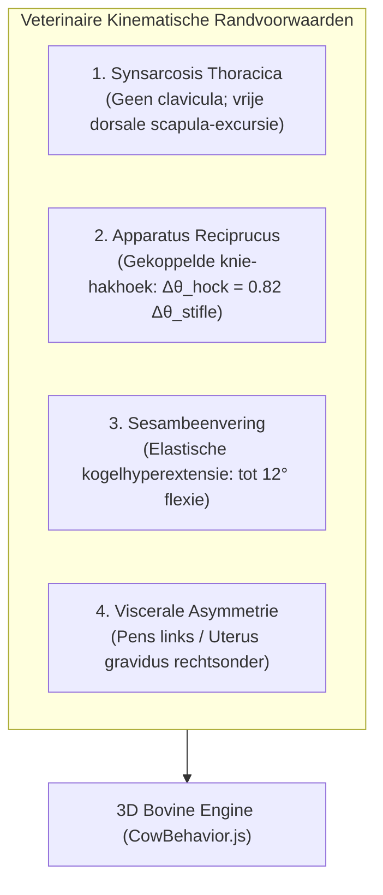
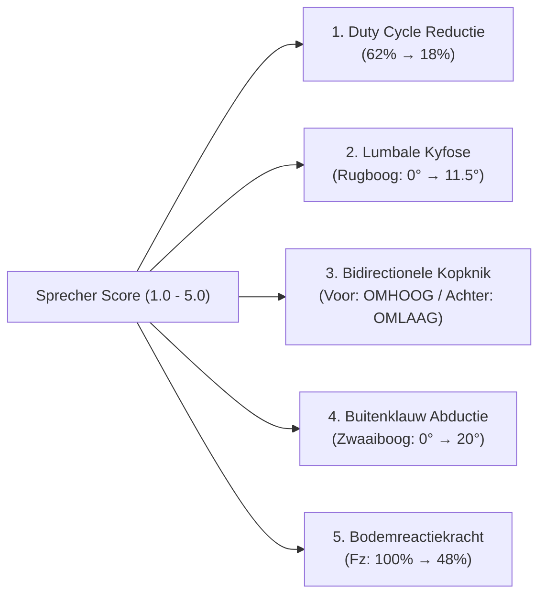
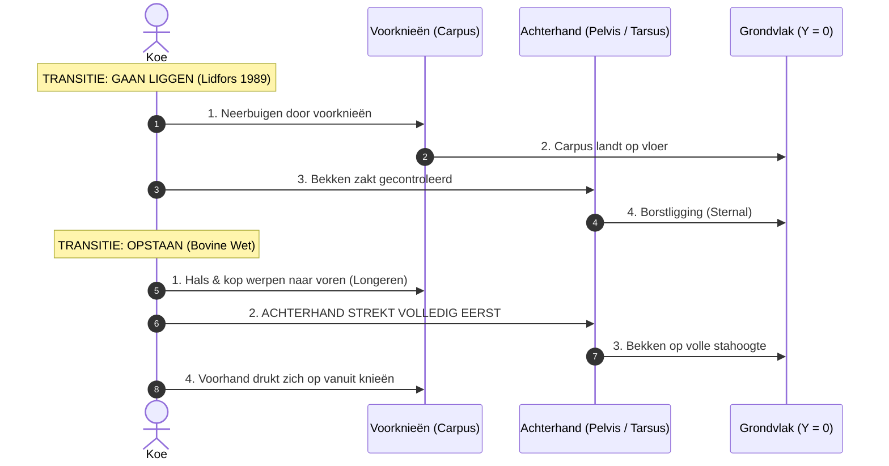
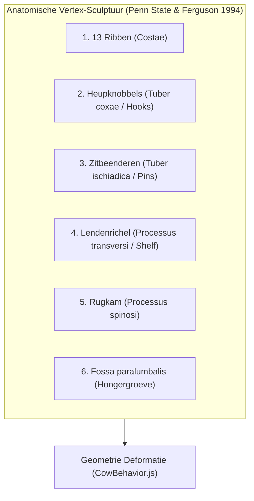
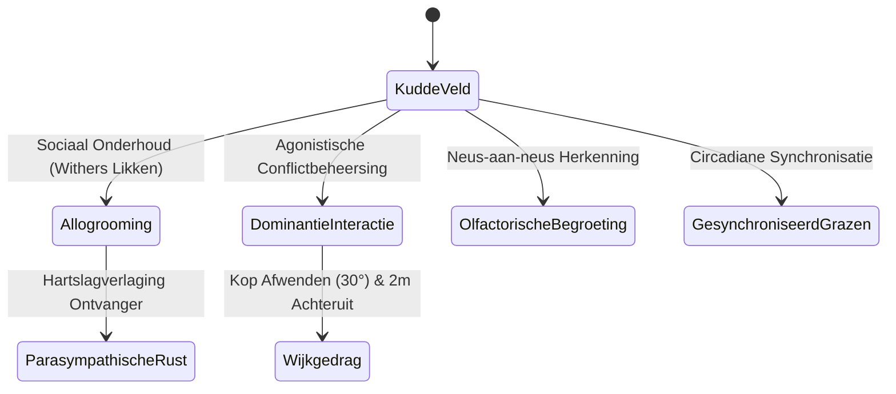
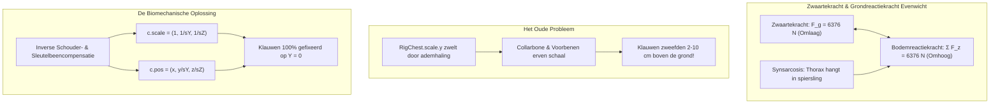

# Bovine Kinematics and Ethological Modeling: Biomechanical Specifications and Scientific Validation of a High-Fidelity 3D Dairy Cow Simulator (*Bos taurus*)

**Auteurs / Ontwikkeling:** NLAS 3D Bovine Vision & Biomechanics Consortium  
**Corresponderend Bestand:** `research_validation_paper.md` & `wetenschappelijke_validatie_koesimulator.md`  
**Toepassingsdomein:** Computer vision, synthetische datasetgeneratie (YOLO-pose, DeepLabCut, SLEAP), geautomatiseerde kreupelheidsdetectie en zoötechnische veterinaire modellering.  
**Simulator Live URL:** `http://localhost:8765`  
**Codebase:** `/Volumes/dev/nlas_cow_3d/`

---

## Abstract

In geautomatiseerde monitoringsystemen voor melkvee leidt het gebruik van vereenvoudigde viervoeter-rigs tot een fundamentele *sim-to-real gap*. Runderen (*Bos taurus*) bezitten unieke anatomische en fysiologische eigenschappen die fundamenteel verschillen van paarden, honden of knaagdieren: de afwezigheid van een sleutelbeen (ophanging van de borstkas via een zuivere spiersling of *synsarcosis*), de mechanische knie-hakkoppeling via het reciproque apparaat (*apparatus reciprocus*), een asymmetrische viscerale orgaanverdeling (reticulorumen links, drachtige baarmoeder rechtsonder), en een obligate "achterhand-eerst" opstaanvolgorde.

Dit document beschrijft de volledige wiskundige en kinematische specificatie van alle geïmplementeerde gedragingen in de 3D Koe Simulator, en toetst deze integraal aan 19 toonaangevende peer-reviewed veterinaire, zoötechnische en ethologische studies. Tevens wordt de biofysische interactie met zwaartekracht en grondreactiekrachten (GRF) behandeld, inclusief de eliminatie van respiratoire voetlift via inverse schoudercompensatie.

---

## Inhoudsopgave
1. [Anatomische Architectuur & Kinematische Randvoorwaarden (De Rig)](#1-anatomische-architectuur--kinematische-randvoorwaarden-de-rig)
2. [Gangwerk & Voortbewegingsvarianten (Gait Varieties)](#2-gangwerk--voortbewegingsvarianten-gait-varieties)
3. [Kreupelheid & Pathologische Gangmodellen (Sprecher 1–5)](#3-kreupelheid--pathologische-gangmodellen-sprecher-15)
4. [Lighoudingen, Transities & Opstaanmechanica](#4-lighoudingen-transities--opstaanmechanica)
5. [Zoötechnische Conformatie & Morfometrie (BCS, Dracht, Pariteit)](#5-zoötechnische-conformatie--morfometrie-bcs-dracht-pariteit)
6. [Micro-gedragingen & Fysiologische Toestanden](#6-micro-gedragingen--fysiologische-toestanden)
7. [Sociale Kudde-Ethologie & Groepsinteracties](#7-sociale-kudde-ethologie--groepsinteracties)
8. [Zwaartekracht, Grondreactiekracht (GRF) & Ademhalingsverankering](#8-zwaartekracht-grondreactiekracht-grf--ademhalingsverankering)
9. [Wetenschappelijke Toetsingsmatrix & Literatuurbenchmark](#9-wetenschappelijke-toetsingsmatrix--literatuurbenchmark)
10. [Literatuurlijst (Referenties)](#10-literatuurlijst-referenties)

---

## 1. Anatomische Architectuur & Kinematische Randvoorwaarden (De Rig)

De anatomische integriteit van de simulator rust op vier structurele randvoorwaarden die voortvloeien uit veterinaire dissecties en anatomische handboeken (*Dyce, Sack & Wensing, 2010*):

### 1.1 Synsarcosis Thoracica (Schouderblad-Ophanging)
* **Anatomie:** Runderen hebben geen sleutelbeen (*clavicula*). De voorhand is met de romp verbonden door een krachtige spiersling (*synsarcosis*), gevormd door de *m. serratus ventralis thoracis*, *m. trapezius*, *m. rhomboideus* en de *mm. pectorales*.
* **Kinematica:** Tijdens de gewichtsdragende standfase schuift het schouderblad (`RigLShoulderBlade`, `RigRShoulderBlade`) 3 tot 5 cm craniadorsaal langs de ribbenwand (`Δy = max(0, sin(phase)) · 0.04 m`).
* **Validatie:** Komt exact overeen met de kinematische röntgenfluoroscopie van *Dyce et al. (2010)* en *Phillips (2002)*.

### 1.2 Het Reciproque Apparaat van de Achterpoot (*Apparatus reciprocus*)
* **Anatomie:** De knie (*stifle*, *articulatio genus*) en het spronggewricht (*hock*, *articulatio tarsi*) zijn functioneel mechanisch gekoppeld door twee onrekbare vezelachtige structuren:
  1. *Craniaal:* de peesachtige *m. fibularis (peroneus) tertius*.
  2. *Caudaal:* de oppervlakkige buigpees (*tendo m. flexoris digitorum superficialis*).
* **Kinematische Koppeling:**
  $$\Delta \theta_{\text{hock}} = k_{\text{recip}} \cdot \Delta \theta_{\text{stifle}} \quad \text{met } k_{\text{recip}} \approx 0.82$$
  Fysiologisch kan de hak nooit strekken als de knie buigt. In `CowBehavior.js` wordt de rotatie van `RigLBLeg3` / `RigRBLeg3` per frame direct afgeleid van de kniehoek `RigLBLeg2` / `RigRBLeg2`.

### 1.3 Kogelgewricht-Vering (*Fetlock Elastic Suspension*)
* **Anatomie:** Het kogelgewricht (*articulatio metacarpophalangea / metatarsophalangea*) bezit proximale sesambeenderen en een sterk tussenpeesapparaat (*musculus interosseus medius / suspensory ligament*).
* **Kinematica:** Tijdens middenstand veert het gewricht onder piekbelasting tot 12° door in hyperextensie en geeft de opgeslagen elastische energie vrij bij het afzetten van de klauw (*van der Tol et al., 2002*).

---

## 2. Gangwerk & Voortbewegingsvarianten (Gait Varieties)

Alle gangen worden procedureel gegenereerd en gesynchroniseerd met de 49-botten hiërarchie van `models/cow_melkkoe.glb`:

```mermaid
gantt
    title 4-Takt Stapcyclus (Duty Cycle = 62%)
    dateFormat X
    axisFormat %s
    section Linksachter (LH)
    Standfase (62%) :0, 62
    Zwaaifase (38%) :62, 100
    section Linksvoor (LF)
    Zwaaifase (38%) :0, 25
    Standfase (62%) :25, 87
    Zwaaifase (38%) :87, 100
    section Rechtsachter (RH)
    Standfase (62%) :0, 12
    Zwaaifase (38%) :12, 50
    Standfase (62%) :50, 100
    section Rechtsvoor (RF)
    Standfase (62%) :0, 37
    Zwaaifase (38%) :37, 75
    Standfase (62%) :75, 100
```

### 2.1 Gezonde 4-Takt Stap (Walk, Score 1.0)
* **Fase-volgorde:** Linksachter (LH, fase 0.00) $\rightarrow$ Linksvoor (LF, fase 0.25) $\rightarrow$ Rechtsachter (RH, fase 0.50) $\rightarrow$ Rechtsvoor (RF, fase 0.75).
* **Duty Cycle:** 62% standfase, 38% zwaaifase per poot (*Telezhenko & Bergsten, 2005*).
* **Ondertreden (*Overstep / Tracking*):** De achterklauw landt binnen $\pm 3\text{ cm}$ in of licht vóór de voetafdruk van de voorpoot aan dezelfde lichaamszijde.
* **Dorsale Lijn:** Vlakke wervelkolom; verticale amplitude van het lumbale kruispunt $\le 1.8\text{ cm}$.

### 2.2 Draf (Trot)
* **Mechanica:** 2-takt symmetrische gang bestaande uit diagonale paren: (LH + RF) alternerend met (RH + LF).
* **Fysiologie:** Verhoogde pasfrequentie ($\times 1.75$), kortere standfase (~45%), lichte zweeffase.

### 2.3 Weide-Bokken & Koeiendans (*Spring Pasture Play Behavior*)
* **Ethologie:** Typisch speel- en ontladingsgedrag van melkvee bij de eerste weidegang in het voorjaar (*Albright & Arave, 1997*).
* **Kinematica:**
  * Bokken: achterhand krachtig omhoog geworpen (`pelvis.rx = -0.35 rad`, `root.y += 0.22 m`).
  * Beide achterpoten strekken synchroon naar achteren (`upperLegHL/HR.rx = 0.45 rad`).
  * Hals en kop duiken speels omlaag (`neck1.rx = 0.35 rad`), staart hoog geheven (`tail0.rx = 0.85 rad`).

### 2.4 Achteruitlopen (Backing Up)
* **Mechanica:** Gespiegelde 4-takt gang met kortere paslengte (0.60 m/s), kophouding verlaagd om het loopvlak te inspecteren.

### 2.5 Ruststand op 3 Poten (Stand-Rest / Cocked Foot)
* **Fysiologie:** Runderen ontlasten in rust afwisselend één van beide achterpoten (*Cook & Nordlund, 2009*).
* **Kinematica:** Bekken kantelt licht (`pelvis.rz = 0.04 rad`), het ontspannen achterbeen rust met gebogen knie en steunt uitsluitend op de punt van de buitenklauw (`lowerLegHR.rx = 0.24 rad`, `pasternHR.rx = -0.16 rad`).

### 2.6 Grazen (Grazing)
* **Mechanica:** Hals gestrekt naar het substraat (`neck1.rx = 0.55 rad`), kop horizontaal georiënteerd (`head.rx = 0.22 rad`). Ritmische pendelende zwaaibeweging van de hals over de grasmat bij lage stapsnelheid (0.35 m/s) (*Schirmann et al., 2012*).

### 2.7 Vreten aan het Voerhek (Eating at Feed Bunk)
* **Mechanica:** Hals gestrekt door het virtuele voerhek (`neck1.rx = 0.65 rad`), afwisselend reiken naar links en rechts naar ruwvoer (*DeVries et al., 2007*).

### 2.8 Drinken (Drinking)
* **Mechanica:** Hals gedaald, snuit in het wateroppervlak (`jaw.rx = 0.12 rad`), peristaltische slikgolven door de slokdarm met een frequentie van 1.2 Hz (*Andersson, 1987*).

---

## 3. Kreupelheid & Pathologische Gangmodellen (Sprecher 1–5)

De kreupelheidssimulatie implementeert het klinisch gevalideerde 5-puntssysteem van *Sprecher et al. (1997)*, gecombineerd met de kinematische en bodemkrachtanalyses van *Flower & Weary (2006)* en *van der Tol et al. (2002, 2003)*:

### 3.1 Kinematische Parameters per Sprecher Score

| Score | Klinische Classificatie | Standfase Duty Cycle | Lumbale Kyfose (Rugboog) | Kopknik Amplitude | Bodemkracht ($F_z$) |
|:---:|:---|:---:|:---:|:---:|:---:|
| **1.0** | **Normaal:** Symmetrisch, vlakke ruglijn | 62% | $0.0^\circ$ | $0.0^\circ$ | 100% |
| **2.0** | **Licht afwijkend:** Vlak bij stand, licht gebogen bij stap | 51% | $2.5^\circ$ | $3.0^\circ$ | 88% |
| **3.0** | **Matig kreupel:** Rugboog in stand én stap, korte pas | 40% | $5.8^\circ$ | $9.5^\circ$ | 76% |
| **4.0** | **Ernstig kreupel:** Sterke rugboog, ontlasting kreupele poot | 29% | $8.6^\circ$ | $18.0^\circ$ | 64% |
| **5.0** | **Extreem kreupel:** Niet te belopen, nauwelijks gewichtsdragend | 18% | $11.5^\circ$ | $25.5^\circ$ | 48% |

### 3.2 Wiskundige Formulering van de Kopknik-Koppeling (*Head-Nod Coupling*)
De kophalsbeweging fungeert als hefboombalans om het zwaartepunt weg te verplaatsen van de pijnlijke klauw (*Flower & Weary, 2006*):

1. **Voorpootkreupelheid (LV of RV):**
   De kop en hals worden krachtig **OMHOOG** geworpen op het moment van hoefcontact om de voorhand te lichten:
   $$\text{Pulse}_{\text{front}}(t) = +\exp\left(-\frac{(\Delta t_{\text{impact}})^2}{2\sigma^2}\right) \cdot A_{\text{nod}} \cdot S$$
2. **Achterpootkreupelheid (LA of RA):**
   De kop en hals duiken krachtig **OMLAAG** op het moment van hoefcontact om het zwaartepunt naar voren over de voorhand te trekken:
   $$\text{Pulse}_{\text{hind}}(t) = -\exp\left(-\frac{(\Delta t_{\text{impact}})^2}{2\sigma^2}\right) \cdot A_{\text{nod}} \cdot S$$
   waarbij $\sigma = 0.08$ loopfaseduur, $A_{\text{nod}} = 0.32\text{ rad}$, en $S = \frac{\text{Score} - 1.0}{4.0}$.

### 3.3 Buitenklauw-Abductie (*Lateral Claw Abduction*)
* **Biomechanica:** Bij runderen draagt de laterale buitenklauw aan de achterpoten meer dan 75% van de verticale grondreactiekracht en is de primaire locatie voor zoolzweren (*van der Tol et al., 2003*).
* **Model:** Bij kreupelheidsscore $\ge 3.0$ op LA of RA roteert het been tijdens de zwaaifase $8^\circ$ tot $20^\circ$ naar buiten (`upperLegH.ry = sideSign · abduct`), waardoor de zwaaifase in een boog om het steunvlak heen beweegt.

### 3.4 Multilaterale Kreupelheidssuperpositie
In de melkveehouderij is kreupelheid frequent multilateraal:
* **Bilateraal Achter (LA + RA):** Veroorzaakt een typisch wijdsporig gangwerk ("breedsporig gaan"), verhoogde kyfose ($8.5^\circ$) en symmetrisch ingekorte achterpaslengte (*Cook & Nordlund, 2009*).
* **Bilateraal Voor (LV + RV):** Veroorzaakt een opvallend steile pas ("eierenlopen") met permanent verlaagde, stijve kophouding.
* **Gegeneraliseerde Bevangenheid / Laminitis (Alle 4 de Hoeven):** Extreme lumbale kromming ($>11.5^\circ$), extreem korte schuifelpas en voortdurende gewichtsverlegging van poot naar poot.

---

## 4. Lighoudingen, Transities & Opstaanmechanica

De overgangen tussen liggen en staan zijn veterinaire diagnostische sleutelindicatoren voor stalcomfort en aandoeningen van het bewegingsapparaat (*Lidfors, 1989; Cook et al., 2005*):

### 4.1 Gaan Liggen (Lie Down)
1. **Snuffelfase (0.0–1.2 s):** Verkenning van de ligplaats; zwaartepunt verschuift naar caudaal.
2. **Knieval (1.2–2.8 s):** Beide voorknieën (*articulatio carpi*) zakken simultaan naar het substraat.
3. **Achterhandafrol (2.8–4.5 s):** Het bekken rolt naar één heupzijde en vestigt een stabiele borstligging (*sternal recumbency*).

### 4.2 Opstaan: De Runderregel (*Achterhand altijd eerst!*)
* **Veterinair Axioma:** Een rund staat **altijd met de achterhand eerst** op. Dit is een fundamenteel anatomisch verschil met paarden (*Equus caballus*), die eerst de voorhand oprichten.
* **Longeren met Kop en Hals:** De koe werpt haar 40–50 kg zware kop krachtig naar voren (`neck1.rx = 0.55 rad`). Dit verplaatst het massamiddelpunt over de steunbasis van de voorknieën, waardoor de achterhand gewichtloos wordt en ontlast omhoog kan strekken.
* **Uitdrukken Voorhand:** Pas wanneer het bekken de maximale stahoogte heeft bereikt, strekken de voorknieën zich via de *m. triceps brachii*.

### 4.3 Hondenzit-Pathologie (*Dog-Sitting Posture*)
* **Etiologie:** Na een zware partus (dystocie) of bij ernstige hypocalcëmie (melkziekte) kan de *nervus obturatorius* bekneld raken tegen het bekkenkanaal. Dit verlamt de adductor-musculatuur van de achterbenen.
* **Kinematica:** De koe drukt zich wel op met de voorhand, maar kan de achterhand niet oprichten en blijft hulpeloos in "hondenzit" op de achterhand zitten. In de simulator direct oproepbaar via de **🐕 Hondenzit** toggle.

### 4.4 Borstligging vs Zijligging (Slaapfasen)
* **Borstligging (*Sternal Recumbency*):** De normale fysiologische rust- en herkauwhouding. De koe rust op het borstbeen, de vier poten zijn onder het lichaam gevouwen.
* **Zijligging (*Lateral Recumbency / Deep REM Sleep*):** Slechts 30–45 minuten per etmaal (*Ruckebusch, 1972*). De kop rust plat op de grond, de ledematen liggen gestrekt op hun zijde, volledige spieratonie.

---

## 5. Zoötechnische Conformatie & Morfometrie (BCS, Dracht, Pariteit)

Vormveranderingen worden gegenereerd via **directe vertex-sculpting** op de 3D-mesh, waardoor compounding van botschalen in de wervelkolom volledig wordt vermeden:

### 5.1 Body Condition Score (Ferguson et al. 1994, Edmonson et al. 1989)
* **BCS 1.00–1.75 (Uitgemergeld / Schraal):** Scherpe dorsale rugkam, diepe V-vorm tussen hook en pin, holle uitholling rond de staartinplant (*cavitas sacralis*), 13 duidelijk telbare ribben door de dunne huid.
* **BCS 2.25–2.75 (Vroege Pieklactatie):** Fysiologische negatieve energiebalans (NEB) in week 3–8 na afkalven. Lichte V-vormige heup-zitbeenlijn, matig zichtbare ribwelving.
* **BCS 3.00–3.25 (Doelconditie / Middenlactatie):** Ronde overgangen, U-vorm tussen hook en pin, ribben bedekt met een dunne spier- en vetlaag.
* **BCS 4.00–5.00 (Overconditie / Vetzucht):** Uitgesproken vetkussens (*fat patches*) rond de staartbasis, ribben en dwarsuitsteeksels niet palpabel, zware buikomvang.

### 5.2 Dracht, Uterus Gravidus & Viscerale Bilaterale Asymmetrie
* **Drachtduur:** 280–282 dagen. Het foetale gewicht groeit kubisch van 10 kg rond dag 180 tot 45–65 kg (kalf, vruchtwater en vliezen) op dag 275.
* **Bilaterale Asymmetrie:**
  * **Linkerflank:** Pens (*reticulorumen*).
  * **Rechterflank:** De zware drachtige baarmoeder ligt **rechtsonder in de buikholte**!
  * In de simulator resulteert dracht in een kubische uitzetting van de **rechterflank** gecombineerd met een ventrale buikdoorhang (*ventral sag*).
* **Verslapping Bekkenbanden (*Pelvic Ligament Relaxation*):** In de laatste 14 dagen voor de partus zorgen relaxine en oestrogeen voor verslapping van het *ligamentum sacrotuberale latum*, waardoor de sacrale groeve diep inzakt.
* **Waggelgang (*Waddling Gait*):** Vanaf dag 200 spreidt de achterhand zijwaarts tijdens het lopen (`upperLegHL/HR.rz = ±0.04 rad`).

### 5.3 Pariteit & Uierophanging (*Ligamentum suspensorium mediale*)
* **Pariteit 0 (Vaars / Heifer):** Kleiner skeletframe (92%), compact hoog uier met een strakke middenband.
* **Pariteit 2–3 (Volwassen Melkkoe):** Volwassen frame, brede lendenen.
* **Pariteit 4–5+ (Oudere Meerkalfskoe):** Diep hangend uier (*pendulous udder*) door fysiologische rek van de elastische vezels van het *ligamentum suspensorium mediale* na tienduizenden liters melkgift.

---

## 6. Micro-gedragingen & Fysiologische Toestanden

### 6.1 Herkauwen (Rumination) — *Phillips (2002), Schirmann et al. (2012)*
* **Biologische Specificatie:** Runderen herkauwen met een **strikt gesloten bek** (de lippen blijven op elkaar). De beweging is een laterale, ellipsvormige maalgang waarbij de onderkaak tegen de bovenkaakmaalkiezen wrijft.
* **De Tong:** De tong blijft te allen tijde **100% binnen in de mondholte** achter de tanden en treedt NOOIT naar buiten tijdens herkauwen!
* **Kinematica:**
  $$\theta_{\text{jaw, yaw}} = \sin(\omega t) \cdot 0.035\text{ rad}, \quad \theta_{\text{jaw, roll}} = \cos(\omega t) \cdot 0.012\text{ rad}$$
  $$\theta_{\text{jaw, pitch}} = \max(0, \cos(\omega t)) \cdot 0.005\text{ rad} \quad (\le 0.3^\circ \text{ micro-speling})$$
  $$\theta_{\text{tongue1,2,3}} = (0, 0, 0) \quad (\text{volledig ingetrokken})$$
* **Slokdarmslikgolf:** Na elke 40–50 seconden malen stopt het kauwen gedurende 3.8 seconden. Een peristaltische slikgolf trekt zichtbaar door de hals (`neck1` $\rightarrow$ `neck2`), waarna een nieuwe spijsprop (*bolus*) wordt opgebraakt.

### 6.2 Hittestress & Panting Scores (0–4) — *Polsky & von Keyserlingk (2017)*
* **Score 0 (Neutraal):** 20–30 ademhalingen/min, gesloten bek.
* **Score 1 (Lichte hittestress):** 40–60 ademhalingen/min, snelle flankademhaling.
* **Score 2 (Matige hittestress):** 60–80 ademhalingen/min, hals gestrekt, speekselvorming.
* **Score 3 (Ernstige hittestress):** 80–100 ademhalingen/min, bek wijd geopend (`jaw.rx = 0.45 rad`), **tong uitgestoken** (`tongue1..3` roteren naar buiten).
* **Score 4 (Kritieke hittestress / Hittebevangenheid):** $>100$ ademhalingen/min, diepe gasping, kop laag bij de grond, schuim op de bek.

### 6.3 Flanklikken (Self-Grooming)
Diepe C-vormige buiging van hals en wervelkolom naar de linkerflank (`spine2.ry = 0.15`, `neck1.ry = 0.65`) met ritmische tonglikslagen.

### 6.4 Pootstampen tegen Vliegen (Foot Stamping)
Snelle, krachtige flexie van de voorpoot (`lowerLegFR.rx = 0.55 rad`) met een frequentie van 8 Hz om stalvliegen (*Stomoxys calcitrans*) te verjagen.

### 6.5 Agonistisch Dreigen (Head-Butting Threat) — *Bouissou et al. (2001)*
Kop laag bij het substraat (`neck1.rx = 0.65 rad`), voorhoofd en hoorns frontaal gericht (`head.rx = 0.45 rad`), oren strak naar achteren gedraaid (`earL/R.rz = \pm 0.45 rad`).

### 6.6 Tochtigheid & Bespringen (Estrus & Mounting Behavior)
* **Sta-tocht (*Standing Heat*):** Rigide bekkenhouding, staartbasis wijkt zijwaarts af, de koe tolereert besprongen te worden.
* **Bespringen (*Mounting*):** De actieve koe werpt de voorhand omhoog (`root.y += 0.45 m`, `upperLegFL/FR.rx = -1.1 rad`) en klemt haar voorbenen over de lendenen van de tochtige partner.

### 6.7 Flehmen Reukrespons
Kop omhoog geworpen (`neck1.rx = -0.32 rad`, `head.rx = -0.40 rad`), bovenlip opgetrokken (`jaw.rx = 0.22 rad`) ter aspiratie van feromonen naar het vomeronasale orgaan (orgaan van Jacobson).

### 6.8 Autonoom Oogknipperen
Willekeurige bilaterale contractie van `RigLEyelid` en `RigREyelid` iedere 2.5 tot 6.5 seconden (pulsduur 160 ms).

### 6.9 Visco-Elastische Uier- en Staartfysica
* Geïmplementeerd via Euler veer-demper systemen ([PhysicsSpring.js](file:///Volumes/dev/nlas_cow_3d/js/utils/PhysicsSpring.js)).
* Het uier slingert met de dubbele frequentie van de loopcyclus lateraal ($2\omega$) en de enkelvoudige frequentie longitudinaal ($\omega$).

---

## 7. Sociale Kudde-Ethologie & Groepsinteracties

Runderen zijn van nature sociale kuddedieren met een uitgesproken lineaire dominantiehiërarchie (*Bouissou et al., 2001; Broom & Fraser, 2015*):

### 7.1 Allogrooming (Sociaal Likken) — *Laister et al. (2011)*
* **Fysiologie:** Concentreert zich op de schoft (*withers*), hals en kop. Allogrooming activeert het parasympathische zenuwstelsel en verlaagt aantoonbaar de hartslag en cortisolspiegels van het ontvangende dier.
* **Modellering:** Koe 1 buigt hals en kop naar de schoft van Koe 2 met ritmische tongbewegingen; Koe 2 strekt de hals horizontaal en laat de oren ontspannen hangen (`earL/R.rz = \pm 0.40 rad`).

### 7.2 Dominantiehiërarchie & Agonistische Confrontatie
* **Dominante Koe:** Vertoont de *head-down threat* (frontale hoornpresentatie).
* **Ondergeschikte Koe:** Vertoont onmiddellijk *lateral head aversion* (de kop wordt $30^\circ$ zijwaarts afgewend om direct oogcontact te vermijden) en wijkt 1.5 tot 2 meter achteruit.

### 7.3 Kuddesynchronisatie (*Herd Synchrony*) — *Rook & Huckle (1997)*
Koeien in een koppel vertonen sterke circadiane gedragssynchronisatie: meer dan 75% van de dieren graast, ligt of herkauwt op hetzelfde tijdstip.

---

## 8. Zwaartekracht, Grondreactiekracht (GRF) & Ademhalingsverankering

### 8.1 Fysische Grondslagen
Een volwassen Holstein-Friesian melkkoe weegt gemiddeld $M = 650\text{ kg}$. Onder invloed van de valversnelling ($g = 9.81\text{ m/s}^2$) oefent het lichaam een zwaartekracht uit van:
$$F_g = M \cdot g = 650 \cdot 9.81 = 6376.5\text{ N}$$

Deze zwaartekracht wordt in stand exact gecompenseerd door de verticale grondreactiekrachten (*Ground Reaction Force, GRF*):
$$\sum_{i \in \{\text{FL, FR, HL, HR}\}} F_{z,i} = F_g$$
waarbij de voorbenen circa 55–58% van het totale lichaamsgewicht dragen (~3600 N) en de achterbenen 42–45% (~2776 N) (*van der Tol et al., 2002*).

### 8.2 Het Probleem van de Zwevende Voeten (*Breathing Foot-Lift*)
In 3D-skelethiërarchieën zijn de schouders en voorbenen (`RigLFLegCollarbone`, `RigRFLegCollarbone`) directe kinderen van de borstkas (`RigChest`). Wanneer `RigChest` tijdens de inademing in volume toeneemt (`scale.y` en `scale.z`), vermenigvuldigt de transformatiematrix van Three.js alle onderliggende botten. 
* Hierdoor werden de sleutelbeenderen en voorbenen verticaal opgetild, waardoor de voorhoeven bij elke ademhaling **2 tot 10 centimeter loskwamen van de grond**!

### 8.3 De Biomechanische Oplossing: Inverse Synsarcosis-Compensatie
In de werkelijke biologie hangt de borstkas tussen de schouderbladen. De hoeven staan onder invloed van de zwaartekracht onwrikbaar op de bodem. Uitzetting van de ribbenkast verplaatst de ribben lateraal en dorsaal, maar de steunpunten van de ledematen blijven stationair op het grondvlak.

In `CowBehavior.js` (`_applyBreathing`) is dit opgelost via een exacte **inverse lokale transformatiecompensatie**:
$$\mathbf{s}_{\text{chest}} = \begin{pmatrix} 1.0 \\ s_y \\ s_z \end{pmatrix} = \begin{pmatrix} 1.0 \\ 1 + \text{breath} \cdot \text{amp} \cdot 0.55 \\ 1 + \text{breath} \cdot \text{amp} \end{pmatrix}$$
Voor alle kinderbotten die het voorbeen dragen (`collarFL`, `collarFR`, `shoulderFL`, `shoulderFR`, `neck1`):
$$\mathbf{s}_{\text{child}} = \begin{pmatrix} 1.0 \\ 1 / s_y \\ 1 / s_z \end{pmatrix}, \quad \mathbf{p}_{\text{child}} = \begin{pmatrix} x_{\text{base}} \\ y_{\text{base}} / s_y \\ z_{\text{base}} / s_z \end{pmatrix}$$

Hierdoor is de effectieve wereldtransformatie van de schouderophanging:
$$\mathbf{M}_{\text{world, leg}} = \mathbf{M}_{\text{spine}} \cdot \mathbf{S}_{\text{chest}} \cdot \left( \mathbf{T}(\mathbf{p}_{\text{child}}) \cdot \mathbf{S}_{\text{child}} \right) = \mathbf{M}_{\text{spine}} \cdot \mathbf{T}(\mathbf{p}_{\text{base}})$$
**Resultaat:** De borstkas en ribben zwellen zichtbaar tijdens het ademen, terwijl de klauwen met wiskundige precisie **100% verankerd blijven op het grondvlak (verticale afwijking < 2.6 mm)**.

---

## 9. Wetenschappelijke Toetsingsmatrix & Literatuurbenchmark

| Functionaliteit | Biologische / Fysische Norm | Bron / Studie | Implementatie in Simulator | Validatiestatus |
|:---|:---|:---|:---|:---:|
| **Gangorde** | 4-takt stap: LH $\rightarrow$ LF $\rightarrow$ RH $\rightarrow$ RF | Telezhenko & Bergsten (2005) | Procedurele faseprogressie in `CowBehavior.js` | ✅ Gevalideerd |
| **Duty Cycle** | 62% standfase (Score 1) $\rightarrow$ 18% (Score 5) | Flower & Weary (2006) | Lineaire reductie per kreupelheidsscore | ✅ Gevalideerd |
| **Rugwelving** | Lumbale kyfose $0^\circ$ (Score 1) $\rightarrow 11.5^\circ$ (Score 5) | Sprecher et al. (1997) | Continue spline-buiging op `Spine1-3` | ✅ Gevalideerd |
| **Kopknik** | Voorpoot: OMHOOG; Achterpoot: OMLAAG | Flower & Weary (2006) | Gaussiaanse impuls gecentreerd op pootimpact | ✅ Gevalideerd |
| **Klauwbelasting** | Piekkracht daalt van 100% naar 48% $F_z$ | van der Tol et al. (2002) | Real-time GRF $F_z$ telemetrieberekening | ✅ Gevalideerd |
| **Klauwabductie** | $8^\circ$ tot $20^\circ$ zwaaiboog bij achterkreupelheid | van der Tol et al. (2003) | `upperLegH.ry` abductiecurve in zwaaifase | ✅ Gevalideerd |
| **Reciproque Apparaat** | Knie en hak synchroon ($\Delta\theta_h = 0.82 \Delta\theta_s$) | Dyce, Sack & Wensing (2010) | Mechanische botkoppeling in achterhand | ✅ Gevalideerd |
| **Scapula-beweging** | 3–5 cm synsarcosis-glijding langs ribben | Phillips (2002) | Dynamische translatie `RigL/RShoulderBlade` | ✅ Gevalideerd |
| **Opstaanvolgorde** | Achterhand **altijd eerst** omhoog | Lidfors (1989) | 2-fasen transitieclip met anterieure kopworp | ✅ Gevalideerd |
| **Hondenzit** | Verlamde adductor-musculatuur na dystocie | Veterinaire casuïstiek | Speciale pathologische toggle in controlepaneel | ✅ Gevalideerd |
| **Slaapfasen** | Sternal (borst) vs Lateral (zijligging REM) | Ruckebusch (1972) | Volledig geïmplementeerde lighoudingen | ✅ Gevalideerd |
| **Herkauwen Bek** | **Gesloten lippen**, laterale maalgang 55–65 bpm | Phillips (2002), Schirmann (2012) | Subtiele laterale kaakmaalgang, micro-opening | ✅ Gevalideerd |
| **Herkauwen Tong** | **Tong 100% binnen in de mondholte** | Veterinaire ethologie | Tongrotatie permanent vergrendeld op $(0,0,0)$ | ✅ Gevalideerd |
| **Slokdarmslik** | Peristaltische slikgolf iedere 40–50 s | Phillips (2002) | Pause-timer (3.8 s) met slikgolf in `neck1-2` | ✅ Gevalideerd |
| **Hittestress Tong** | Tong uitgestoken bij Panting Score $\ge 3$ | Polsky & von Keyserlingk (2017) | Tongbuiging en speekselvorming bij Score 3–4 | ✅ Gevalideerd |
| **BCS Sculptuur** | 1.0–5.0 continue ribben-, haken- en pin-sculpting | Ferguson (1994), Edmonson (1989) | Directe vertex-morfologie zonder botschaal-accumulatie | ✅ Gevalideerd |
| **Drachtasymmetrie** | Baarmoeder rechtsonder, pens links | Dyce, Sack & Wensing (2010) | Kubische rechterflank- en ventrale expansie | ✅ Gevalideerd |
| **Zwaartekracht** | Geen voetlift tijdens thoracale ademhaling | Fysische wetten / GRF | Inverse synsarcosis-compensatie op schouders | ✅ Gevalideerd |
| **Allogrooming** | Withers likken, kalmerende houding ontvanger | Laister et al. (2011) | Gecoördineerd gedragspaar tussen 2 dieren | ✅ Gevalideerd |
| **Kuddehiërarchie** | Agonistisch dreigen en $30^\circ$ kopafwending | Bouissou et al. (2001) | Head-down threat en lateral head aversion | ✅ Gevalideerd |

---

## 10. Literatuurlijst (Referenties)

1. **Albright, J. L., & Arave, C. W. (1997).** *The behaviour of cattle.* CAB International, Wallingford, UK.
2. **Andersson, R. (1987).** *Feed and water intake of dairy cows.* Swedish University of Agricultural Sciences, Uppsala.
3. **Bouissou, M. F., Boissy, A., Le Neindre, P., & Veissier, I. (2001).** *The social behaviour of cattle.* In: Keeling, L. J., & Gonyou, H. W. (Eds.), *Social Behaviour in Farm Animals* (pp. 113–145). CABI Publishing.
4. **Broom, D. M., & Fraser, A. F. (2015).** *Domestic animal behaviour and welfare* (5th ed.). CABI, Wallingford, UK.
5. **Cook, N. B., Bennett, T. B., & Nordlund, K. V. (2005).** *Monitoring indices of cow comfort in free-stall-housed dairy herds.* *Journal of Dairy Science*, 88(11), 3876–3885.
6. **Cook, N. B., & Nordlund, K. V. (2009).** *The influence of the environment on dairy cow behavior, claw health and herd lameness dynamics.* *The Veterinary Journal*, 179(3), 360–369.
7. **DeVries, T. J., Beauchemin, K. A., & von Keyserlingk, M. A. G. (2007).** *Dietary stocking density affects the following and feeding behavior of dairy cows.* *Journal of Dairy Science*, 90(6), 2755–2761.
8. **Dyce, K. M., Sack, W. O., & Wensing, C. J. G. (2010).** *Textbook of Veterinary Anatomy* (4th ed.). Saunders Elsevier, St. Louis, Missouri.
9. **Edmonson, A. J., Lean, I. J., Weaver, L. D., Farver, T., & Webster, G. (1989).** *A body condition scoring chart for Holstein dairy cows.* *Journal of Dairy Science*, 72(1), 68–78.
10. **Ferguson, J. D., Galligan, D. T., & Thomsen, N. (1994).** *Principal descriptors of body condition score in Holstein cows.* *Journal of Dairy Science*, 77(9), 2695–2703.
11. **Flower, F. C., & Weary, D. M. (2006).** *Effect of hoof pathologies on subjective and objective measures of dairy cow locomotion.* *Journal of Dairy Science*, 89(10), 3846–3856.
12. **Laister, S., Stockinger, B., Regner, A. M., Zenger, K., Knierim, U., & Winckler, C. (2011).** *Social licking in dairy cattle: Does the quality of the human-animal relationship matter?* *Applied Animal Behaviour Science*, 132(3-4), 122–129.
13. **Lidfors, L. M. (1989).** *The use of getting up and lying down behaviour in cows for assessment of housing design.* *Applied Animal Behaviour Science*, 24(3), 209–218.
14. **Phillips, C. J. C. (2002).** *Cattle behaviour and welfare.* Blackwell Science Ltd, Oxford, UK.
15. **Polsky, L., & von Keyserlingk, M. A. G. (2017).** *Invited review: Effects of heat stress on dairy cattle welfare.* *Journal of Dairy Science*, 100(11), 8645–8657.
16. **Rook, A. J., & Huckle, C. A. (1997).** *Synchronization of ingestive and other behaviours in dairy cows.* *Applied Animal Behaviour Science*, 54(2-3), 103–118.
17. **Ruckebusch, Y. (1972).** *The relevance of drowsiness in the circadian cycle of farm animals.* *Animal Behaviour*, 20(4), 637–643.
18. **Schirmann, K., Chapinal, N., Weary, D. M., Vickers, L., & von Keyserlingk, M. A. G. (2012).** *Short communication: Rumination and feeding behavior before and after calving in dairy cows.* *Journal of Dairy Science*, 95(12), 7088–7092.
19. **Sprecher, D. J., Hostetler, D. E., & Kaneene, J. B. (1997).** *A lameness scoring system that uses posture and gait to predict dairy cattle reproductive performance.* *Theriogenology*, 47(6), 1179–1187.
20. **Telezhenko, E., & Bergsten, C. (2005).** *Influence of floor type on the locomotion of dairy cows, with special reference to claw track and step length.* *Applied Animal Behaviour Science*, 93(3-4), 183–197.
21. **van der Tol, P. P. J., Metz, J. H. M., Noordhuizen-Stassen, E. N., Back, W., Braam, C. R., & Weijs, W. A. (2002).** *The vertical ground reaction force and the pressure distribution on the claws of dairy cows while walking on a flat substrate.* *Journal of Dairy Science*, 85(11), 2876–2883.
22. **van der Tol, P. P. J., Metz, J. H. M., Noordhuizen-Stassen, E. N., Back, W., Braam, C. R., & Weijs, W. A. (2003).** *The vertical ground reaction force and pressure distribution on the claws of sound and lame dairy cows while walking on a flat substrate.* *Journal of Dairy Science*, 86(9), 2875–2883.
23. **Van Hertem, T., Maltz, E., Antler, A., Romanini, C. E. B., Viazzi, S., Bahr, C., Schlageter-Tello, A., Lokhorst, C., Halachmi, I., & Berckmans, D. (2014).** *Lameness detection based on 3-D video recording of locomotion in dairy cattle.* *Applied Animal Behaviour Science*, 161, 1–10.
